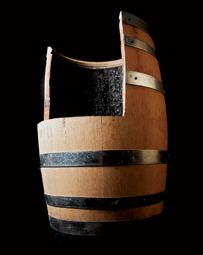
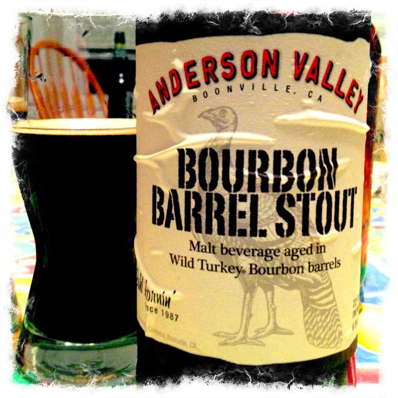
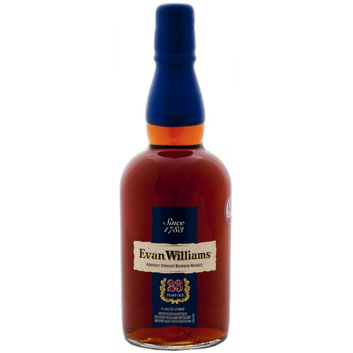
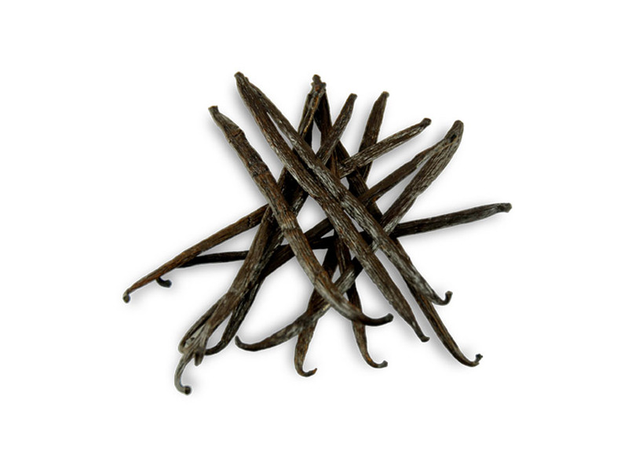
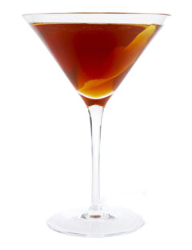
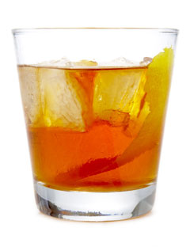
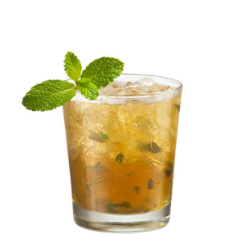

!SLIDE

!SLIDE

#Bourbon

##(not the sass library)

!SLIDE

#America

!SLIDE

#Whiskey comes from all over

!SLIDE

#Bourbon is American

!SLIDE

#1964
##"distinctive product of the United States."

!SLIDE

#Can only be made in America

##(according to America and Canada)

!SLIDE

#Mash must be at least 51% corn

##(the rest is usually barley, wheat, or rye)

!SLIDE

#Age in NEW charred oak barrels

!SLIDE

#Once the barrel is used, it's sold to someone else

!SLIDE

!SLIDE

#Must age for at least 2 years

##(most are aged well past that)

!SLIDE

#White whiskey isn't aged at all
##(so it's not bourbon)

!SLIDE

#Aged up to 23 years

!SLIDE

#Distilled to no more than 80% ABV

!SLIDE

#Casked at no more than 62.5% ABV

!SLIDE

#Bottled at 40% ABV

##(but you can get 'cask strength')

!SLIDE

#Tennessee Whiskey
##Charcoal filtered

!SLIDE

#Charring produces flavor compounds

!SLIDE

#The longer it's in the barrel, the more complex the flavor gets

!SLIDE

#Manhattan

!SLIDE

#Manhattan

* 2 oz bourbon
* 1/2 oz sweet vermouth
* 2-3 dashes Angostura bitters
* Maraschino cherry for garnish

!SLIDE

#Old Fashioned

!SLIDE

#Old Fashioned

* 1 Cube of Sugar
* 2 dashes Angostura bitters
* 1 small piece ice
* 1 piece of lemon peel
* 1.5 oz bourbon

!SLIDE

#Mint Julep

!SLIDE

#Mint Julep
* 4 fresh mint sprigs, muddled
* 2 1/2 oz bourbon
* 1 tsp powdered sugar
* 2 tsp water

!SLIDE

#Tasting! And Questions!
